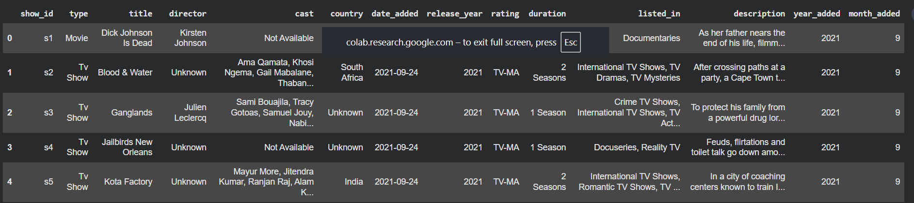

# Netflix Data Cleaning and Preprocessing

## Objective
Clean and preprocess a raw Netflix dataset by handling missing values, standardizing formats, and preparing the data for analysis.

## Steps Performed

1. Loaded dataset using Pandas
2. Explored dataset structure and statistics
3. Identified missing values
4. Filled missing values in:
   - director
   - cast
   - country
   - rating
   - date_added
5. Checked for duplicate records
6. Standardized text formatting
7. Cleaned column names
8. Converted date_added to datetime format
9. Verified data types
10. Performed data quality checks
11. Exported cleaned dataset

## Tools Used
- Python
- Pandas
- NumPy
- Google Colab

## Screenshots

### Before Handling Missing Values

### After Handling Missing Values

### Data Cleaning Summary

### Final Dataset Preview

### Release Year Analysis

## Output
- Cleaned Netflix dataset ready for analysis
